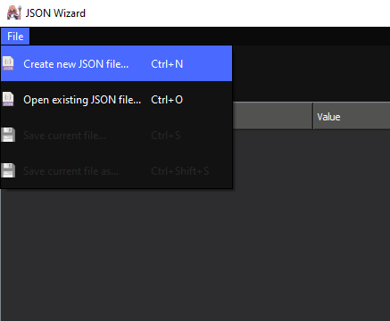
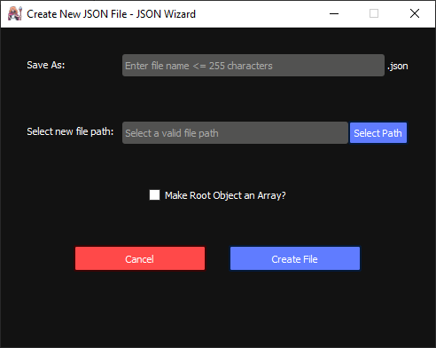
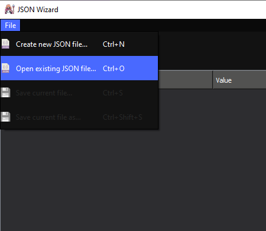
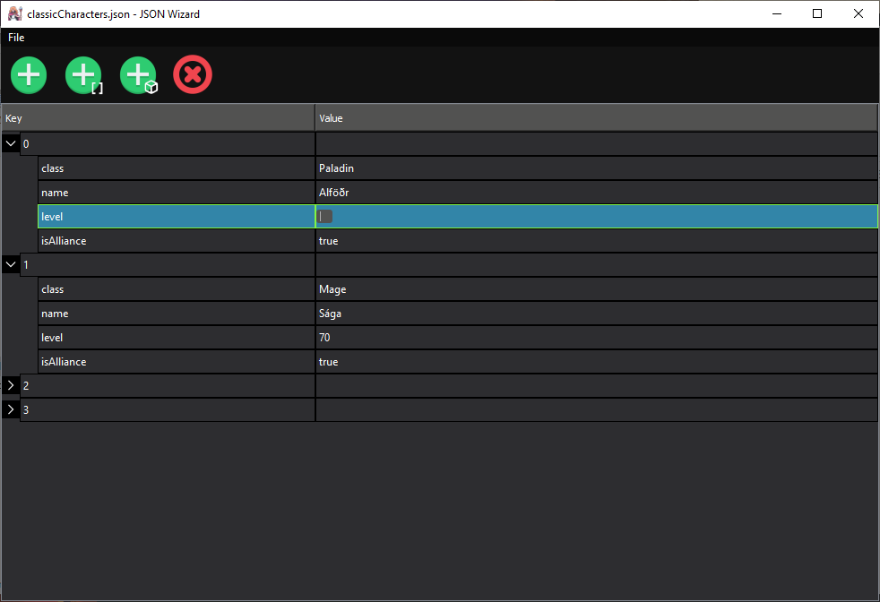
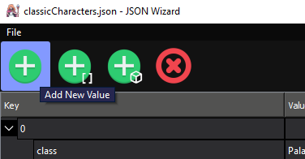
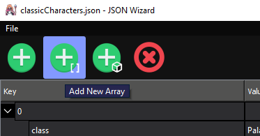
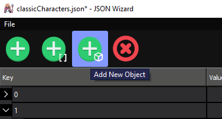
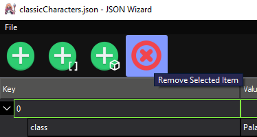
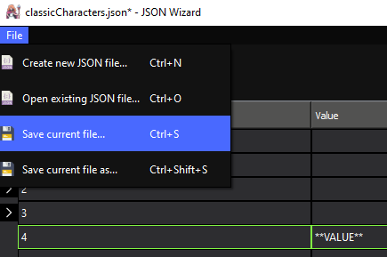
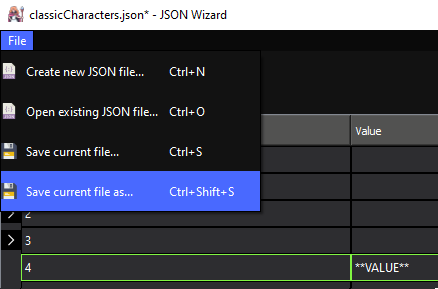

<h1 align="center">
    JSON Wizard
    
</h1>
JSON Wizard is a lightweight, standalone desktop tool for working with JSON files. It allows users to edit, add, or remove contents from a JSON file through a simple visual tree structure.

---
## **How to Launch JSON Wizard**
---

JSON Wizard can be be opened one of two ways, through Python and the command line, or though the standalone .exe application. 

1. To open JSON Wizard through the command line requires a few prerequistes:
   1. Python 3.10 or higher installed on the machine
   2. Using PIP, install [pathvalidate](https://pypi.org/project/pathvalidate/) and [PySide2](https://pypi.org/project/PySide2/) as shown below:
           
           pip install PySide2
           pip install pathvalidate
   Once these dependencies are installed, the application can be launched using `JSONWizard.py` in the `src` folder.

       ...\src> python JSONWizard.py

2. The second and easiest way to use the tool is to simply launch the `JSONWizard.exe` file in the main `JSONWizard` folder

---
## **How to Use JSON Wizard**
---
<h2 align="center">
    <i>Creating a new JSON file</i>
</h2>

To create a new JSON file navigate to the `File` menu at the top of the application and select "Create New JSON file" or press `CTRL+N`

    

Once you have selected to create a new JSON file, a pop up menu will appear for creating the new file and choosing its location.

    

---

<h2 align="center">
    <i>Opening an existing JSON file</i>
</h2>

To open an existing JSON file navigate to the `File` menu at the top of the application and select "Open existing JSON file" or press `CTRL+O`

    

This will bring you to a file explorer window to choose a JSON file to open. 

---

<h2 align="center">
    <i>Editing JSON files</i>
</h2>

## Editing Existing Values

To edit the contents of any existing field in a JSON Document, simply double-click the *value* column of the field to begin editing

    

JSON Wizard will parse your input automatically and, when saved, will determine the data type of each field. 
* If a number is entered, the tool will save it in JSON as a number. 
* If `True`, `true`, `False`, or `false` are entered, it will save it in JSON as a boolean.
* If `null` is entered, the field will be made blank in the editor and will save it in JSON as null.
* Any other inputs in JSON fields will be interpreted and saved as a string

JSON Objects and Arrays created will not allow the *value* column to be changed

## Adding New Values

To add a new JSON Value, Array, or Object use the three add buttons on the top toolbar. If no row is selected, the item will be added to the root of the JSON document by default. If an Array or Object is selected, the item will be added to it as a child. Otherwise it will be added to the parent of the JSON value that is selected as a child.

    
    
    

One thing to note about the editor is that it will ignore any input for the *Key* column for each element of an array, and will instead only show its index in the array

## Removing Existing Values

To remove any field in a JSON Document, select a row to remove and click the red remove button at the right end of the toolbar.

    

If the row selected is a non-empty Array or Object, there will be a deletion confirmation pop up that appears to make sure you dont accidentally delete a large amount of data.

---

<h2 align="center">
    <i>Saving JSON files</i>
</h2>

## Saving JSON 

If the currently open JSON file has unsaved changes, a small asterisk (\*) will appear next to the files name in the window title

    

To save a JSON file, navigate to the `File` menu at the top of the application and select "Save current file" or press `CTRL+S`

    

## Saving JSON as a new file

To save a JSON file as a new file, navigate to the `File` menu at the top of the application and select "Save current file as" or press `CTRL+SHIFT+S`

    

If JSON Wizard is closed with unsaved changes, a popup will appear asking whether to save the changes, discard them, or to cancel closing of the application.

    

---